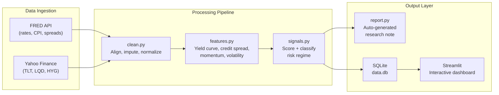

# Fixed Income Signal Engine

A modular Python research pipeline that ingests macroeconomic and fixed income market data, engineers quantitative features, classifies market regimes, and generates automated research notes — built to support systematic investment decision-making.

---

## Architecture



---

## Quick Start

```bash
# 1. Clone and enter the project
git clone https://github.com/<your-username>/fundemental_equity_project.git
cd fundemental_equity_project

# 2. Create a virtual environment and install dependencies
python -m venv .venv
.venv\Scripts\activate        # Windows
# source .venv/bin/activate   # macOS / Linux
pip install -r requirements.txt

# 3. Add your FRED API key (free: https://fred.stlouisfed.org/docs/api/api_key.html)
cp .env.example .env
# Edit .env and replace your_api_key_here with your key

# 4. Run the pipeline
python main.py

# 5. Launch the dashboard
streamlit run streamlit_app.py
# or: streamlit run dashboard/app.py
```

---

## Deploying the dashboard (e.g. Streamlit Community Cloud)

The SQLite file `data/data.db` and generated reports under `output/` are **not** in Git (see `.gitignore`). A fresh clone or cloud deploy therefore has **no database** until something builds it.

**Critical:** In Streamlit Community Cloud, the **Main file path** must be the UI entry — **`streamlit_app.py` (recommended)** or **`dashboard/app.py`**.

**Do not** set it to **`main.py`**. That file is only the CLI batch pipeline; Streamlit will try to run it as an app and you can get import errors (e.g. `KeyError: 'src.clean'`) or a broken page.

1. **Main file path:** `streamlit_app.py` (or `dashboard/app.py`)
2. **Secrets (exact name):** In **App settings → Secrets**, use TOML with the variable name **`FRED_API_KEY`** (all caps, underscores — must match what the code reads):

   ```toml
   FRED_API_KEY = "paste_your_fred_key_here"
   ```

   Save, then **Reboot app** (or wait for redeploy). First successful load may take **30–60 seconds** while FRED + Yahoo Finance are fetched.

3. **If charts stay empty:** An older bug could leave a **partial** `data.db` (no `signals` table). **Reboot** the app after updating — the dashboard now detects that and rebuilds. Check **Manage app → Logs** for API errors.

4. **Without a key:** the app cannot fetch FRED data until you add secrets or run `python main.py` locally.

---

## What It Does

| Stage | Module | Description |
|-------|--------|-------------|
| **Ingest** | `src/ingest.py` | Pulls Treasury yields, Fed Funds rate, CPI, HY OAS from FRED; bond ETF prices (TLT, LQD, HYG) from Yahoo Finance. Retries on failure, caches locally for offline re-runs. |
| **Clean** | `src/clean.py` | Aligns all series to business-day frequency, forward-fills gaps, normalises column names, persists to CSV and SQLite. |
| **Features** | `src/features.py` | Computes yield curve spread (10Y-2Y), credit spread (HY OAS or ETF proxy), rolling momentum (30d, 90d), and annualised volatility. |
| **Signals** | `src/signals.py` | Z-scores features into a weighted composite risk score; classifies each day into a regime: *Recession Risk*, *Credit Stress*, *Risk On*, or *Neutral*. |
| **Report** | `src/report.py` | Auto-generates a structured research note with market snapshot, signal interpretation, and risk assessment. |
| **Dashboard** | `dashboard/app.py` | Interactive Streamlit app with metric cards, tabbed Plotly charts (yield curve, credit spread, momentum/vol, regime-coloured risk score), and the latest research note. |

---

## Sample Output

```
================================================================
  FIXED INCOME SIGNAL ENGINE — RESEARCH NOTE
================================================================
  Date: April 07, 2026
  Regime: Credit Stress
  Composite Risk Score: +1.23
----------------------------------------------------------------

MARKET SNAPSHOT
  Yield Curve Spread (10Y-2Y):  +0.42 %
  Credit Spread (HY OAS):       +5.87 %
  30-Day Bond Momentum:         -1.34 %
  90-Day Bond Momentum:         -3.21 %
  Annualised Volatility:        16.8 %

----------------------------------------------------------------
SIGNAL INTERPRETATION

  * Yield curve is positively sloped, consistent with a normal
    growth environment.
  * Credit spreads are elevated at +5.87%, indicating stress
    in corporate credit markets.
  * Short-term bond momentum is negative, suggesting recent
    selling pressure in rates markets.

----------------------------------------------------------------
RISK ASSESSMENT

  Current regime classification: Credit Stress

  Elevated credit spreads signal deteriorating risk appetite.
  Consider reducing high-yield exposure in favour of
  investment-grade or sovereign bonds.

================================================================
  Generated by Fixed Income Signal Engine
================================================================
```

---

## Data Sources

| Source | Series | Description |
|--------|--------|-------------|
| [FRED](https://fred.stlouisfed.org) | `DGS10` | 10-Year Treasury Constant Maturity Rate |
| FRED | `DGS2` | 2-Year Treasury Constant Maturity Rate |
| FRED | `FEDFUNDS` | Federal Funds Effective Rate |
| FRED | `CPIAUCSL` | Consumer Price Index (All Urban, Seasonally Adjusted) |
| FRED | `BAMLH0A0HYM2` | ICE BofA US High Yield Option-Adjusted Spread |
| [Yahoo Finance](https://finance.yahoo.com) | `TLT` | iShares 20+ Year Treasury Bond ETF |
| Yahoo Finance | `LQD` | iShares iBoxx Investment Grade Corporate Bond ETF |
| Yahoo Finance | `HYG` | iShares iBoxx High Yield Corporate Bond ETF |

---

## Design Decisions & Tradeoffs

- **Modular pipeline over monolithic notebook** — each stage is an importable module with a clear interface, making it testable and extensible. A notebook can call these modules for ad-hoc exploration, but the pipeline itself runs from the command line.
- **SQLite over Postgres** — zero-config persistence that anyone can clone and run immediately. For production at scale, swap in a cloud-hosted database.
- **Forward-fill for rate data** — standard market convention; rates don't change on weekends but the last known value is the best estimate. ETF prices are inner-joined so weekends/holidays are excluded.
- **Z-scored composite scoring** — normalising features before weighting prevents any single indicator from dominating due to scale differences. Weights are configurable in `config.yaml`.
- **Regime priority ordering** — yield curve inversion overrides other signals because of its historically strong recession-prediction track record.
- **Local caching** — after the first API fetch, raw data is saved to CSV so the pipeline works offline and is idempotent.

---

## Testing

```bash
python -m pytest tests/ -v
```

21 tests covering feature calculations (yield curve spread, credit spread, momentum, volatility) and signal logic (regime classification, score weighting, edge cases).

---

## What I'd Do Next

- **Scheduling** — add a cron job or AWS Lambda to run the pipeline daily and push alerts on regime changes.
- **More signals** — integrate term-premium estimates, real yields (TIPS breakevens), and cross-asset momentum (equity VIX, DXY).
- **Backtesting framework** — evaluate signal accuracy against realised returns to optimise weights empirically.
- **Cloud deployment** — containerise with Docker, store data in S3, serve the dashboard via Streamlit Cloud or EC2.
- **Alerting** — send Slack / email notifications when regime transitions occur or risk score breaches a threshold.

---

## Project Structure

```
fundemental_equity_project/
├── src/
│   ├── ingest.py        # Data ingestion (FRED + Yahoo Finance)
│   ├── clean.py         # Cleaning, alignment, persistence
│   ├── features.py      # Feature engineering
│   ├── signals.py       # Scoring + regime classification
│   └── report.py        # Research note generation
├── tests/
│   ├── test_features.py
│   └── test_signals.py
├── dashboard/
│   ├── app.py           # Streamlit dashboard
│   └── style.css        # Custom theme
├── data/                # Raw + processed data (gitignored)
├── output/              # Generated reports (gitignored)
├── main.py              # Pipeline orchestrator
├── config.yaml          # All tunable parameters
├── requirements.txt
├── .env.example         # FRED API key template
└── README.md
```

---

*Built as a demonstration of systematic research workflow design for fixed income portfolio management.*
